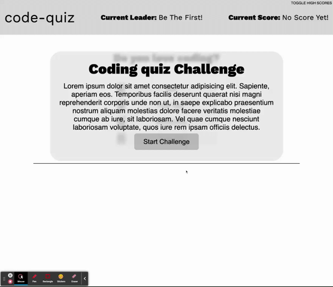

# Code Quiz Challenge

Welcome to the Code Quiz Challenge! I hope you can answer them all before time runs out!

## The Way it Works

The Code Quiz works by alerting the user to start the game. Once clicked is will start a countdown and then dynamically updating the questions and answers via vanilla Javascript. Once an answer is selected, the program checks to see if it is the correct answer. If it is the correct answer, it will alert them they answered correctly, update their score on screen and in localStorage. If they answer incorrectly time will be deducted from the clock and alert them they answered incorrectly. Once the game is over (by way of no more questions left or if they ran out of time), it will take them to an end screen which will display a comparison between how they did to the high scorer (if one if present). If they are the new high scorer it will then ask them to input their name into a field and submit. Once submitted their name goes into the high score field in localStorage and on screen.

## Technologies used

I used a variety of things including HTML, CSS, and Javascript.

## Inspiration and Resources

There were a few points where I got stuck and I used some youtube videos to get me unstuck. The main channel that helped me was James Q Quicks Channel. You can see his channel here: https://www.youtube.com/c/JamesQQuick/featured.

## Live Link

https://mcewball13.github.io/code-quiz/
